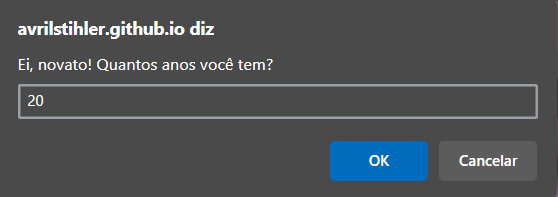
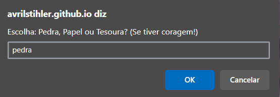
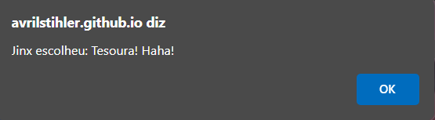

# 🎮 Pedra, Papel e Tesoura: Desafio da Jinx 💥

Um mini-jogo em JavaScript onde você é desafiado por ninguém menos que a insana e imprevisível **Jinx**! Prepare-se para uma batalha de Pedra, Papel e Tesoura — mas antes, você precisa provar que tem idade (e coragem) suficiente para jogar. 💣

> _“Vai chorar ou vai tentar de novo?” – Jinx_ 🎯

Clique [aqui](https://avrilstihler.github.io/Pedra-papel-tesoura/) para acessar o game.

## Como funciona:

A função `jogar()` é o coração do game e segue essa lógica:

### Verificação de Idade

- O jogador precisa informar sua idade.
- Se tiver menos de 18 anos, **Jinx te zoa e te expulsa do jogo**! 😆

### Escolha sua arma

- Você escolhe entre **Pedra**, **Papel** ou **Tesoura**.
- A Jinx faz sua jogada aleatória.
- A escolha da Jinx é revelada com um toque de sarcasmo.

### Resultado da Batalha

- **Empate**? Jinx boceja de tédio.
- **Vitória do jogador**? Ela se enfurece!
- **Derrota**? Prepare-se para a risada maluca da Jinx!

## Exemplo de Gameplay

| 👶 Verfifcação de Idade | ⚔️ Jogada do Player |
|---|---|
|  |  |

| 🎲 Jogada da Jinx |🏆 Resultado Final
|---|---|
|  |  |

## Tecnologias Utilizadas

- JavaScript, Html e CSS
- `prompt()` e `alert()` para interação com o jogador
- `Math.random()` para gerar a escolha da Jinx
- Validação de entrada com `.trim()` e `includes()`

## Destaques

- 🧠 Lógica simples para aprender estruturas condicionais
- 😈 Frases personalizadas inspiradas na personalidade da Jinx
- 💬 Interação dinâmica e divertida direto no navegador

